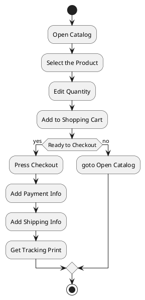

# Introduction to Computer Science

Welcome to the exciting world of Computer Science! In this introductory course, we will explore the fundamental concepts that underlie the field of computer science, equipping you with a strong foundation to understand and engage with the rapidly evolving technological landscape. Let's dive into the key topics we'll be covering:

## 1. History of Computer Science
We'll begin our journey by delving into the historical roots of computer science. We'll explore the contributions of visionary mathematicians and thinkers who laid the groundwork for modern computing.

## 2. Pseudo Language
Understanding the basics of programming is essential. We'll introduce you to a simplified programming language, often referred to as a "pseudo language." You'll get hands-on experience with constructs like `if/else` statements, `for` and `while` loops, input/output operations, and various processing operations like assignment, calculation, incrementing, and concatenation.

### Examples:
```pseudo
if temperature > 30:
    print("It's a hot day!")
else:
    print("Enjoy the weather!")
    
for i in range(5):
    print("Hello, iteration", i)
    
num = input("Enter a number: ")
print("You entered:", num)
```

## 3. Flow Diagrams
Visualizing the flow of a program is crucial for understanding its logic. We'll introduce flow diagrams, a graphical representation of a program's execution flow. You'll learn about different shapes and symbols used, such as the start and end symbols, rectangles for process steps, diamonds for `if/else` conditions, and more.

### Example Flow Diagram (Using PlantUML):



## 4. Algorithms
Algorithms are step-by-step procedures for solving problems. We'll discuss the importance of algorithms in computer science and explore basic sorting algorithms that help arrange data in a specific order.

## 5. Computer Language vs Programming Language
Dive into the distinction between computer languages and programming languages. We'll explore a range of languages, from low-level ones like assembly, to versatile languages like C, C#, and Java, each serving different purposes in software development.

## 6. Programming Setup
Understanding your development environment is crucial. We'll discuss the role of compilers, the difference between SDK (Software Development Kit) and runtime environments, and the benefits of using Integrated Development Environments (IDEs) to streamline your coding process.

## 7. Types of Programming Paradigms
Programming comes in various styles. We'll cover imperative (command) programming and Object-Oriented Programming (OOP), as well as touch on functional programming, which treats computation as the evaluation of mathematical functions.

## 8. Software Applications
Explore the diverse domains where programming skills are applied. We'll look at web development, desktop applications, mobile apps, smartwatches, Internet of Things (IoT) devices, and the role of databases in storing and managing information.

Whether you're new to programming or looking to solidify your understanding, this course will provide you with the essential knowledge to embark on your journey in the world of Computer Science. Let's get started on this exciting adventure!
